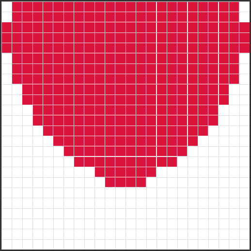

# Pixel Art Editor

[](https://github.com/lucanenni/pixel-art-editor/actions/workflows/test.yml)

A small, dependency-free pixel art editor that runs entirely in the browser. Draw on a resizable grid using color palettes inspired by classic PC graphics cards (CGA/EGA/VGA), then export your drawing as a PNG image or a re-importable JSON file.

Built as a teaching tool for vocational school students (graphic design and IT tracks) — the code is intentionally kept simple, vanilla JavaScript, and easy to read.

> Vibe-coded with Claude, with some manual tweaks on top.

<p align="center">
  
  <br />
  <sub>A drawing made with the editor (24×24 grid, VGA palette).</sub>
</p>

## Features

- **Resizable drawing grid** — 8×8, 12×12, 16×16, 24×24, or 32×32 cells, rendered on a fixed 512×512 canvas
- **Retro color palettes**, generated procedurally:
  - **CGA** — 16 colors
  - **EGA** — 64 colors (4 levels per RGB channel)
  - **VGA** — 256 colors (16 CGA + 16 grayscale + 216 web-safe colors); loaded by default
- **Freehand drawing** — click or click-and-drag across the canvas, with mouse or touch (tablets/touchscreens)
- **Eyedropper** — pick a color straight from an already-drawn pixel
- **Export**
  - as a **PNG** image (`Scarica immagine`)
  - as a **JSON** or **XML** file describing the full drawing state (`Esporta JSON` / `Esporta XML`), so it can be reloaded later
- **Import** a previously exported JSON or XML drawing (`Importa JSON` / `Importa XML`)
- **QR code sharing** (`Mostra QR code`) — generates a QR code encoding the drawing itself; scanning it reopens the app with the drawing restored and automatically downloads it as a PNG
- **Bucket fill** — switch **Strumento** to **Secchiello** and click to flood-fill a contiguous same-colored area (including the blank background) with the selected color
- **Undo/redo** (`Annulla`/`Ripeti`, or Ctrl+Z / Ctrl+Y) — steps back and forward through drawing actions
- **Autosave** — the drawing (grid, palette, pixels) is saved to `localStorage` after every action and restored automatically next time you open the app in the same browser
- **Clear canvas** (`Cancella tutto`)

## Getting started

No build step and no dependencies to install to run the app — it's plain HTML/CSS/JS. The only external dependency is the [qrcodejs](https://cdnjs.cloudflare.com/ajax/libs/qrcodejs/1.0.0/qrcode.min.js) library, loaded from a CDN. `package.json` exists only to give the test suite an `npm test` shortcut around Node's built-in test runner — there's nothing to `npm install`.

Simplest option — just open the file in a browser:

```bash
open index.html
```

Or serve it locally (recommended, avoids browser restrictions on `file://` in some setups):

```bash
python3 -m http.server 8000
```

Then visit `http://localhost:8000`.

### Running tests

Unit tests cover the pure logic in `logic.js` (palette generation, color/pixel validation, XML escaping) using Node's built-in test runner — no packages to install, just a working Node (≥18):

```bash
npm test
```

(equivalent to `node --test`). A GitHub Actions workflow runs the same command on every push/PR — see the badge at the top of this file. Drawing/canvas code isn't covered by these tests, since it needs a real browser; that part was verified manually during development (see [CHANGELOG.md](CHANGELOG.md) for what was checked at each step).

## Usage

1. Pick a **grid size** and a **color palette** from the dropdowns — changing either one clears the current drawing (no automatic resize/conversion of existing pixels).
2. Click a color swatch in the palette to select it, then click or drag on the canvas to draw.
3. Switch **Strumento** to **Contagocce** to pick up a color from a pixel you've already drawn instead of painting — it switches back to **Pennello** automatically after picking. Switch to **Secchiello** to flood-fill a contiguous area (a click, not a drag) instead.
4. Use **Scarica immagine** to download a PNG snapshot of the canvas (grid lines included), or **Esporta JSON**/**Esporta XML** to save the drawing data for later editing.
5. Use **Importa JSON**/**Importa XML** to reload a drawing previously exported from this app (either format).
6. Use **Mostra QR code** to generate a QR code for the current drawing — scanning it (or opening the underlying URL) reopens the app with the drawing restored and downloads it as a PNG automatically. Very large/detailed drawings may exceed the data capacity of a QR code; in that case a metadata-only code is shown instead, with a message suggesting a smaller grid or `Esporta JSON`.
7. Use **Annulla**/**Ripeti** (or Ctrl+Z / Ctrl+Y) to undo/redo drawing actions — one step per stroke, clear, or same-size import. Changing the grid size (or importing a drawing with a different size) resets the undo history.
8. **Cancella tutto** wipes the canvas back to blank.
9. The drawing autosaves as you work — reopening the app (same browser, same device) picks up right where you left off. Opening a shared QR code link takes priority over the autosave for that load.

### JSON export format

```json
{
  "version": "1.0",
  "gridSize": 32,
  "palette": "vga",
  "pixels": { "3,4": "rgb(255,0,0)", "5,5": "rgb(0,0,0)" },
  "timestamp": "2026-08-04T10:00:00.000Z"
}
```

`pixels` maps each painted cell (`"x,y"`) to its CSS color string. On import, `gridSize` and `palette` are checked against the app's known values, and each pixel entry is validated (well-formed `"x,y"` key inside the grid, `rgb(r,g,b)` color with components ≤ 255) — invalid entries are dropped and the user is told how many were skipped.

### XML export format

The same data, as XML:

```xml
<?xml version="1.0" encoding="UTF-8"?>
<pixelArt version="1.0" gridSize="32" palette="vga" timestamp="2026-08-04T10:00:00.000Z">
  <pixels>
    <pixel x="3" y="4" color="rgb(255,0,0)" />
    <pixel x="5" y="5" color="rgb(0,0,0)" />
  </pixels>
</pixelArt>
```

Import applies the exact same validation as JSON (grid size, palette, per-pixel coordinates/color), just reading from `<pixel>` element attributes instead of object keys.

## Project structure

```
.
├── index.html        # page markup: canvas, controls, QR modal
├── style.css         # styling and responsive layout
├── logic.js          # pure logic: palettes, validation — shared with Node tests
├── script.js         # app logic: drawing, undo/redo, export/import, QR code, autosave
├── test/
│   └── logic.test.js # node:test unit tests for logic.js
├── docs/
│   └── demo-heart.png
├── .github/workflows/test.yml  # CI: runs `npm test` on push/PR
├── package.json      # just an `npm test` script, no dependencies
├── ARCHITECTURE.md   # technical deep-dive for maintainers
├── CHANGELOG.md      # feature history
└── LICENSE
```

> For implementation details see [ARCHITECTURE.md](ARCHITECTURE.md); for version history see [CHANGELOG.md](CHANGELOG.md).

## Technical notes

- `pixels` (an object keyed `"x,y"` → CSS color string) is the single source of truth for the drawing; the canvas is just its visual rendering. Anything that needs to restore a drawing (import, future features) should redraw from `pixels`, following the pattern already used in `importDrawing`.
- The canvas has a fixed 512×512px size; `pixelSize` (the on-screen size of one grid cell) is recalculated as `canvas.width / gridSize` whenever the grid size changes.
- Adding a new palette only requires a new `generateXColors()` function, a `case` in `generateColors()`'s switch, and a new `<option>` in `#paletteSelect`. Adding a new grid size only requires a new `<option>` in `#gridSizeSelect` — no other code changes needed.
- The drawing is persisted to `localStorage` (see Autosave above) under a single fixed key; nothing else in the app uses browser storage.

## Known limitations

- **QR code sharing** encodes the drawing's data (grid size, palette, pixels) in the URL, not the image itself — very large or highly detailed drawings can still exceed a QR code's data capacity, in which case a metadata-only code is generated (see above). This is an inherent limit of QR codes, not something a client-only app can fix.
- **Undo/redo history is reset on grid size changes** (including importing a drawing with a different size), since saved snapshots' coordinates wouldn't be meaningful against a different grid.
- **Autosave is per-browser, not synced anywhere**: it uses `localStorage`, so it doesn't follow you to a different browser or device, and is lost if the browser's site data is cleared.

## Possible future improvements

- XML import/export alongside JSON

## License

[MIT](LICENSE) © lucanenni
